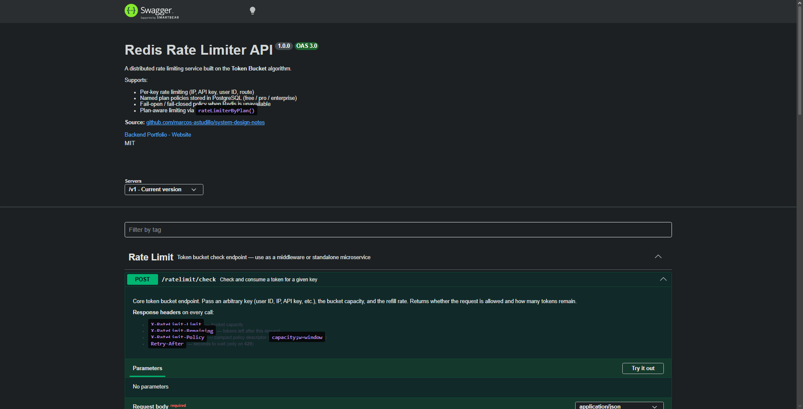

# Redis Rate Limiter


A production-grade **distributed rate limiter** built with Node.js, TypeScript, Redis, and PostgreSQL.

Implements the **Token Bucket** algorithm with **atomic Redis Lua scripts** — no race conditions under concurrent load. Supports plan-based limiting backed by PostgreSQL, optional in-memory fast-path cache, and pluggable key extraction strategies.

> System design reference: [rate-limiter.md](https://github.com/marcos-astudillo/system-design-notes/blob/master/designs/rate-limiter.md)

---

## Features

- **Token Bucket algorithm** — handles burst traffic, configurable refill rate
- **Atomic Redis Lua script** — race-condition-free, single round-trip per request via `EVALSHA`
- **EVALSHA caching** — SHA cached, automatic reload on script eviction (`NOSCRIPT`) with max-retry guard
- **Fail-open / fail-closed** — configurable degradation policy when Redis is unavailable
- **Local in-memory cache** — optional fast-path to skip Redis for keys clearly under limit; periodic eviction prevents memory leaks
- **Pluggable key extraction** — by API key, user ID, IP, IP+route, or custom strategy
- **Plan-based middleware** — `rateLimiterByPlan()` resolves limits from PostgreSQL (cached 60s), bridging the DB and Redis layers
- **Standard rate limit headers** — `X-RateLimit-Limit`, `X-RateLimit-Remaining`, `X-RateLimit-Policy`, `Retry-After`
- **Interactive API docs** — Swagger UI at `/api-docs`, raw OpenAPI JSON at `/api-docs.json`
- **Dual interface** — use as Express middleware or standalone HTTP microservice

---

## Why Token Bucket?

This service uses the Token Bucket algorithm because it:

• Allows burst traffic up to bucket capacity  
• Smooths traffic over time using refill rate  
• Works well with distributed systems using Redis  
• Requires only one atomic operation per request

---

## Use Cases

Typical scenarios:

• API gateways enforcing per-API key limits
• SaaS products limiting tenant usage
• Protecting expensive endpoints (search, AI calls)
• Preventing abuse from IP-based clients

---

## Design Trade-offs

### Redis as state store
Pros:
- Atomic operations with Lua
- Very low latency

Cons:
- External dependency
- Hot key risk

### Fail-open vs Fail-closed
Fail-open improves availability but risks temporary abuse.
Fail-closed protects backend resources but may reject valid traffic.

---

## Architecture

```
Client
  |
  v
API Gateway / Application
  |
  v
Redis Rate Limiter (Express Service)
|
+-- TokenBucketService
| |
| +-- Redis (Token Bucket state via Lua script)
|
+-- PolicyRepository
|
+-- PostgreSQL (rate limit policies)
```

For detailed diagrams and system design documentation see:

- [System Architecture](docs/architecture.md)
- [Request Flow Diagrams](docs/request-flow.md)

These diagrams illustrate the internal components of the rate limiter,
including middleware flow, Redis interactions, and policy resolution.

---

### Token Bucket Lua script (atomic)

```
1. HMGET bucket state (tokens, last_refill_ms)
2. Compute elapsed seconds since last refill
3. tokens = min(capacity, tokens + elapsed x refillPerSec)
4. if tokens >= 1 -> tokens -= 1, allowed = true
5. else -> compute retry_after_ms, allowed = false
6. HSET updated state + EXPIRE (2x full refill time)
7. Return [allowed, remaining, retry_after_ms]
```

---

## API Documentation

Interactive Swagger UI is served at `/api-docs` when the service is running.

```
http://localhost:3000/api-docs        <- Swagger UI (try it live)
http://localhost:3000/api-docs.json   <- Raw OpenAPI 3.0 JSON spec
```

---

## API Preview

Swagger UI for testing the rate limiter endpoints.

<p align="center">
  
</p>

---

## API Endpoints

### Rate Limit Check

```
POST /v1/ratelimit/check
```

**Request:**
```json
{
  "key":            "user:123",
  "capacity":       100,
  "refill_per_sec": 10
}
```

**Response 200 — allowed:**
```json
{ "allowed": true, "remaining": 42, "retry_after_ms": 0 }
```

**Response 429 — rate limited:**
```json
{ "allowed": false, "remaining": 0, "retry_after_ms": 850 }
```

**Response headers (always present):**
```
X-RateLimit-Limit:     100
X-RateLimit-Remaining: 42
X-RateLimit-Policy:    100;w=10
Retry-After:           1        <- only on 429
```

---

### Plan Policies

Named rate limit plans stored in PostgreSQL. Default seed: `free`, `pro`, `enterprise`.

| Method   | Endpoint               | Description                    | Status codes  |
|----------|------------------------|--------------------------------|---------------|
| `GET`    | `/v1/policies`         | List all plans                 | 200           |
| `GET`    | `/v1/policies/:name`   | Get a plan by name             | 200, 404      |
| `POST`   | `/v1/policies`         | Create a new plan              | 201, 400, 409 |
| `PATCH`  | `/v1/policies/:name`   | Update capacity / refill rate  | 200, 400, 404 |
| `DELETE` | `/v1/policies/:name`   | Delete a plan                  | 204, 404      |

**Create plan:**
```json
{ "name": "startup", "capacity": 200, "refill_per_sec": 20 }
```

**Update plan** (partial — at least one field required):
```json
{ "capacity": 1000 }
```

> Policy cache is invalidated immediately on `PATCH` and `DELETE` so changes take effect within the next request.

---

### Other

| Method | Endpoint      | Description                                   |
|--------|---------------|-----------------------------------------------|
| `GET`  | `/health`     | Liveness probe                                |
| `GET`  | `/v1/metrics` | In-process counters + Redis connection status |

---

## Middleware Usage

### Static limits — `rateLimiter()`

```typescript
import { rateLimiter } from './middlewares/rateLimiter';
import { byIp, byApiKey, byIpAndRoute } from './services/keyExtractor';

// Global default (uses env vars)
app.use(rateLimiter());

// Per-route custom limits
router.post('/orders', rateLimiter({ capacity: 50, refillPerSec: 5 }), handler);

// Custom key extraction strategy
router.get('/search', rateLimiter({ keyExtractor: byIpAndRoute, capacity: 20 }), handler);
```

### Plan-aware limits — `rateLimiterByPlan()`

Limits come from the `rate_limit_policies` table (cached 60s). Change limits at runtime without redeploying.

```typescript
import { rateLimiterByPlan } from './middlewares/rateLimiterByPlan';

// Read plan from req.user (set by your auth middleware)
router.post('/orders',
  authMiddleware,
  rateLimiterByPlan({
    getPlan: (req) => req.user?.plan ?? 'free',
  }),
  handler
);

// With fallback when plan is not found in DB
router.get('/search',
  rateLimiterByPlan({
    getPlan: (req) => req.headers['x-plan'] as string ?? 'free',
    fallback: { capacity: 30, refillPerSec: 1 },
  }),
  handler
);
```

**Extra response header added:** `X-RateLimit-Plan: pro`

---


---

## Deployment Modes

This service can run in two different ways depending on your architecture.

### A) Standalone Microservice

Deploy the rate limiter as an independent service. Any application can query it via HTTP.

Example:

```bash
curl -X POST http://rate-limiter:3000/v1/ratelimit/check   -H "Content-Type: application/json"   -d '{"key":"user:123","capacity":100,"refill_per_sec":10}'
```

Flow:

Client App (Node / Python / Go)
        |
        | HTTP
        v
Rate Limiter Service
POST /v1/ratelimit/check
        |
        v
      Redis

Use this mode when:
- multiple services share the same rate limits
- services use different languages
- you want to scale the limiter independently

### B) Embedded Middleware

Import the limiter directly into your Express application.

```typescript
import { rateLimiter } from './middlewares/rateLimiter'

router.post(
  '/orders',
  rateLimiter({ capacity: 50, refillPerSec: 5 }),
  handler
)
```

Flow:

Client
  |
Express App
  |
Rate Limiter Middleware
  |
Redis

Use this mode when:
- the limiter runs inside the same service
- you want minimal latency
- you don't need a separate infrastructure component

### Shared State

In both modes, **all counters live in Redis**, so multiple instances share the same rate limits:

App Instance A
App Instance B
App Instance C
        |
        v
      Redis

This is what makes the system **distributed**.

---

## Feature Flags / Environment Variables

| Variable                          | Default       | Description                                          |
|-----------------------------------|---------------|------------------------------------------------------|
| `PORT`                            | `3000`        | HTTP server port                                     |
| `REDIS_HOST`                      | `localhost`   | Redis host                                           |
| `REDIS_PORT`                      | `6379`        | Redis port                                           |
| `REDIS_PASSWORD`                  | —             | Redis password (optional)                            |
| `REDIS_TLS`                       | `false`       | Enable TLS for Redis connection                      |
| `DB_HOST`                         | `localhost`   | PostgreSQL host                                      |
| `DB_PORT`                         | `5432`        | PostgreSQL port                                      |
| `DB_NAME`                         | `rate_limiter`| Database name                                        |
| `DB_USER`                         | `postgres`    | Database user                                        |
| `DB_PASSWORD`                     | `postgres`    | Database password                                    |
| `RATE_LIMIT_ENABLED`              | `true`        | Global on/off — `false` bypasses all limiting        |
| `RATE_LIMIT_CAPACITY`             | `100`         | Default bucket capacity (max burst)                  |
| `RATE_LIMIT_REFILL_PER_SEC`       | `10`          | Default token refill rate                            |
| `RATE_LIMIT_FAIL_POLICY`          | `open`        | `open` = allow on Redis failure, `closed` = deny     |
| `RATE_LIMIT_LOCAL_CACHE_ENABLED`  | `false`       | Skip Redis for keys clearly under limit              |
| `RATE_LIMIT_LOCAL_CACHE_TTL_MS`   | `500`         | Local cache TTL (milliseconds)                       |
| `LOG_LEVEL`                       | `info`        | `debug`, `info`, `warn`, `error`                     |

---

## Run Locally

### Prerequisites

- Node.js 20+
- Docker + Docker Compose

### Steps

```bash
# 1. Clone and install
git clone https://github.com/marcos-astudillo/redis-rate-limiter.git
cd redis-rate-limiter
npm install

# 2. Configure environment
cp .env.example .env

# 3. Start infrastructure
docker compose up redis postgres -d

# 4. Run database migration (creates tables + seeds default plans)
npm run migrate

# 5. Start dev server with hot-reload
npm run dev
```

Server starts at **`http://localhost:3000`**
Swagger UI at **`http://localhost:3000/api-docs`**

**Quick smoke test:**
```bash
# Single check — should be allowed
curl -s -X POST http://localhost:3000/v1/ratelimit/check \
  -H "Content-Type: application/json" \
  -d '{"key":"user:1","capacity":5,"refill_per_sec":1}' | jq

# Exhaust the bucket — watch for 429
for i in $(seq 1 8); do
  curl -s -X POST http://localhost:3000/v1/ratelimit/check \
    -H "Content-Type: application/json" \
    -d '{"key":"user:1","capacity":5,"refill_per_sec":1}' | jq .allowed
done
```

---

## Run with Docker

```bash
# Build and start all services (Redis + PostgreSQL + App)
docker compose up --build

# Migration runs automatically on startup.
# To run it manually inside the container:
docker compose exec app npm run migrate
```

---

## Tests

```bash
# All tests (requires Redis + PostgreSQL)
npm test

# Unit tests only — no infrastructure needed
npx jest tests/unit

# Integration tests only
npx jest tests/integration

# With coverage report
npm run test:coverage
```

### Test coverage

| Suite       | File                           | What is covered                                          |
|-------------|--------------------------------|----------------------------------------------------------|
| Unit        | `localCache.test.ts`           | TTL expiry, get/set/delete, size                         |
| Unit        | `tokenBucket.service.test.ts`  | Allow/deny, fail-open/closed, local cache, Redis errors  |
| Unit        | `keyExtractor.test.ts`         | All 4 strategies, x-forwarded-for, header arrays         |
| Unit        | `bucketRepository.test.ts`     | EVALSHA, SHA reuse, NOSCRIPT reload, max-retry guard     |
| Integration | `ratelimit.test.ts`            | Headers, 429 enforcement, fail-open, input validation    |
| Integration | `policy.test.ts`               | Full CRUD lifecycle, 400/404/409, duplicate detection    |

Integration tests use **real Redis and PostgreSQL**. The CI pipeline provisions both automatically.

---

## Project Structure

```
src/
+-- config/
|   +-- env.ts                   # Typed, validated environment config
|   +-- redis.ts                 # ioredis singleton client
|   +-- database.ts              # node-postgres pool
|   +-- logger.ts                # Structured JSON logger
|   +-- swagger.ts               # OpenAPI 3.0 spec (schemas, headers, tags)
+-- controllers/
|   +-- ratelimit.controller.ts
|   +-- policy.controller.ts
|   +-- metrics.controller.ts
+-- middlewares/
|   +-- rateLimiter.ts           # Static-limit middleware factory
|   +-- rateLimiterByPlan.ts     # Plan-aware middleware (PostgreSQL -> Redis)
|   +-- requestLogger.ts
|   +-- errorHandler.ts
+-- routes/                      # Express routers + OpenAPI JSDoc annotations
|   +-- ratelimit.routes.ts
|   +-- policy.routes.ts
|   +-- metrics.routes.ts
+-- services/
|   +-- tokenBucket.service.ts   # Algorithm + fail policy + eviction timer
|   +-- localCache.ts            # Generic LocalCache<T> with TTL
|   +-- keyExtractor.ts          # byIp, byApiKey, byUser, byIpAndRoute
|   +-- policy.service.ts
|   +-- metrics.service.ts
+-- repositories/
|   +-- bucket.repository.ts     # Redis EVALSHA + NOSCRIPT retry guard
|   +-- policy.repository.ts     # PostgreSQL CRUD
+-- scripts/
|   +-- tokenBucket.ts           # Lua script as TypeScript constant
+-- models/
    +-- rateLimit.types.ts
    +-- policy.types.ts
tests/
+-- unit/
|   +-- localCache.test.ts
|   +-- tokenBucket.service.test.ts
|   +-- keyExtractor.test.ts
|   +-- bucketRepository.test.ts
+-- integration/
    +-- ratelimit.test.ts
    +-- policy.test.ts
scripts/
+-- schema.sql                   # Idempotent migration + seed data
```

---

## Scaling Considerations

| Concern | Approach |
|---|---|
| Redis single point of failure | Redis Cluster or Redis Sentinel for HA |
| Hot keys | One shard handles the key — monitor CPU; add key sharding if needed |
| High QPS (50k+) | Redis handles ~100k ops/sec per shard; one Lua call per request |
| Clock skew across replicas | Timestamps stored in Redis (server-side), not in the app instance |
| Reducing Redis load | Enable `RATE_LIMIT_LOCAL_CACHE_ENABLED=true` to skip Redis for safe keys |
| Dynamic policy updates | PATCH /v1/policies/:name -> cache invalidated -> new limits on next request |
| Multi-region | Hierarchical: local per-region limiter + global Redis aggregator |
| Metrics aggregation | Counters are per-process — scrape /v1/metrics per replica, aggregate in Prometheus |

---

## CI/CD

GitHub Actions on every push and PR to `main`:

| Step      | Command              | Purpose                                   |
|-----------|----------------------|-------------------------------------------|
| Typecheck | `tsc --noEmit`       | Type correctness                          |
| Lint      | `eslint src`         | Code style                                |
| Migrate   | `npm run migrate`    | Schema + seed on test DB                  |
| Test      | `npm test`           | Unit + integration (real Redis + Postgres) |
| Build     | `tsc`                | Compiles to `dist/`                       |

**Deploy to Railway:** connect the GitHub repo, set env vars from `.env.example`, Railway builds the `Dockerfile` on every push to `main`.

---

## Interview Talking Points

This project demonstrates:

• Distributed rate limiting using Redis
• Atomic concurrency control with Lua scripts
• Middleware-based enforcement
• Dynamic policy management with PostgreSQL
• Observability via metrics endpoint
• Fail-open vs fail-closed resilience strategies
• Local caching optimization to reduce Redis load

---

## License

This project is licensed under the MIT License.

See the [LICENSE](LICENSE) file for details.

---

## 📫 Connect With Me

<p align="center">

  <a href="https://www.marcosastudillo.com">
    
  </a>

  <a href="https://www.linkedin.com/in/marcos-astudillo-c/">
    
  </a>

  <a href="https://github.com/marcos-astudillo">
    
  </a>

  <a href="mailto:m.astudillo1986@gmail.com">
    
  </a>

</p>
