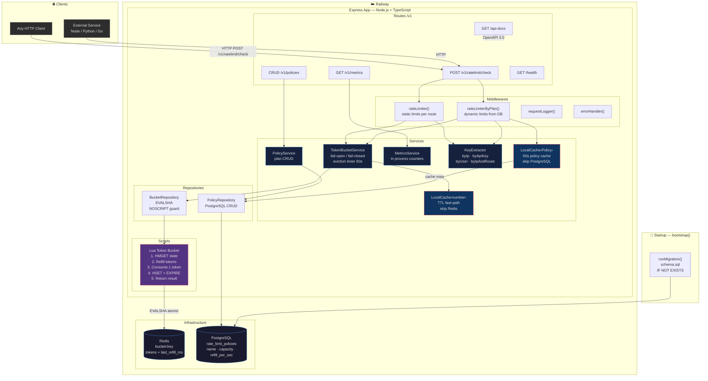
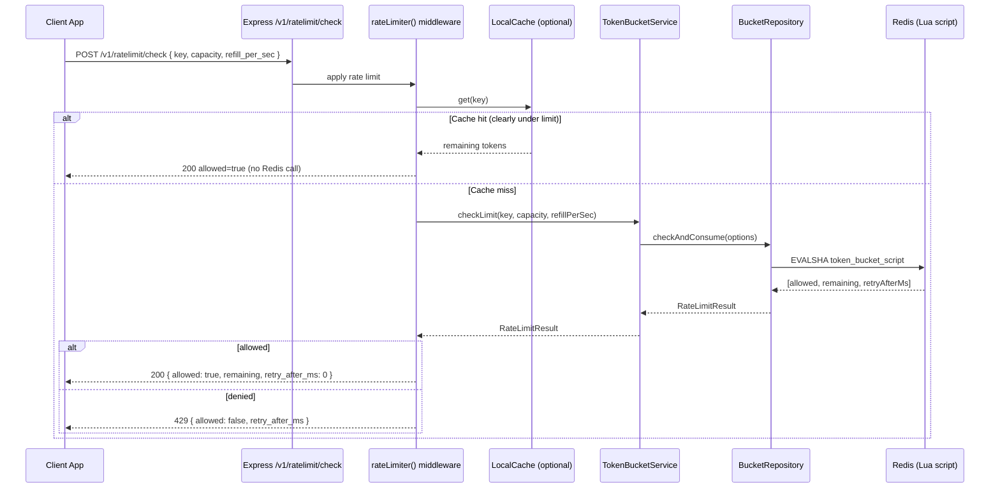
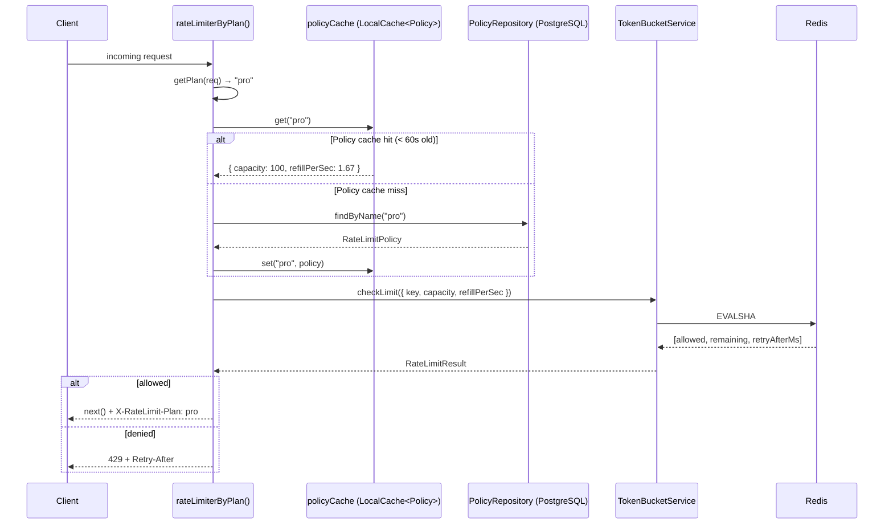
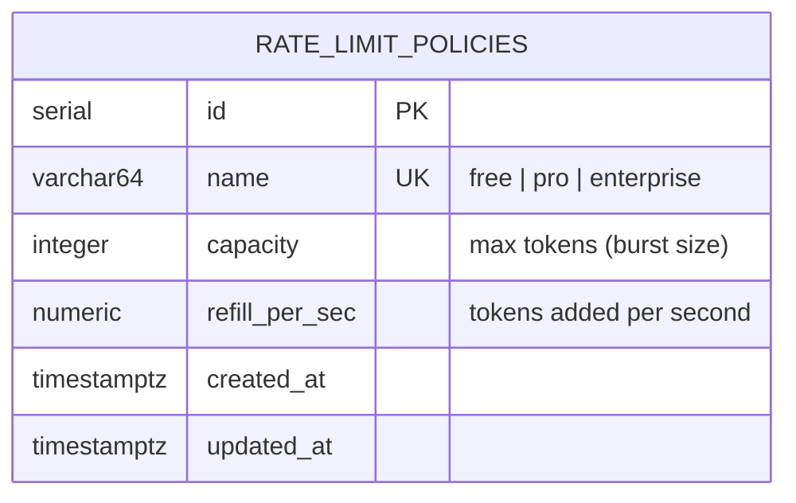

# Architecture Diagram

System architecture of the Redis Rate Limiter service.



---

## Request Flow

### A) Standalone microservice (external HTTP call)



---

### B) Plan-aware middleware (rateLimiterByPlan)



---

## Data Model



**Redis key structure:**

```
bucket:<key>
  tokens         float   "current token count"
  last_refill_ms int     "Unix timestamp of last refill (ms)"

TTL = ceil((capacity / refillPerSec) * 2) seconds
```
