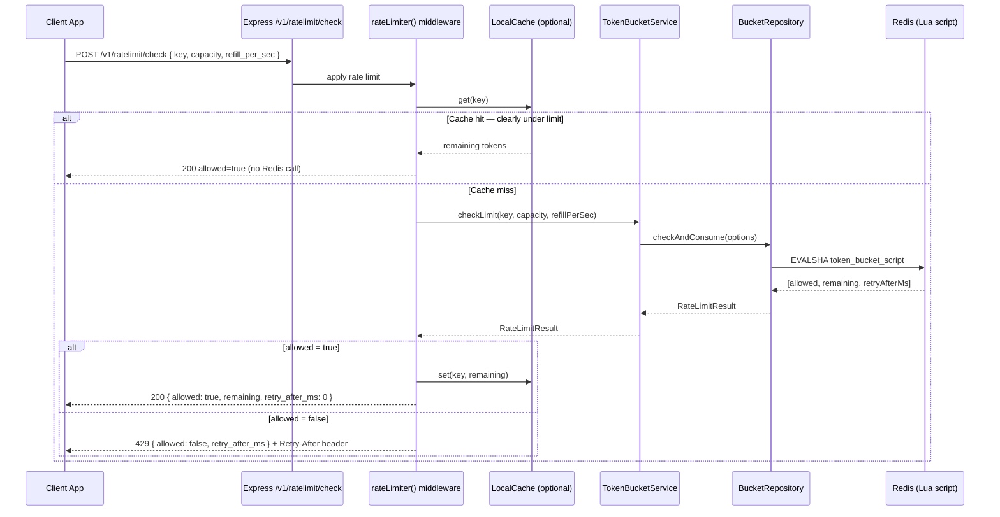
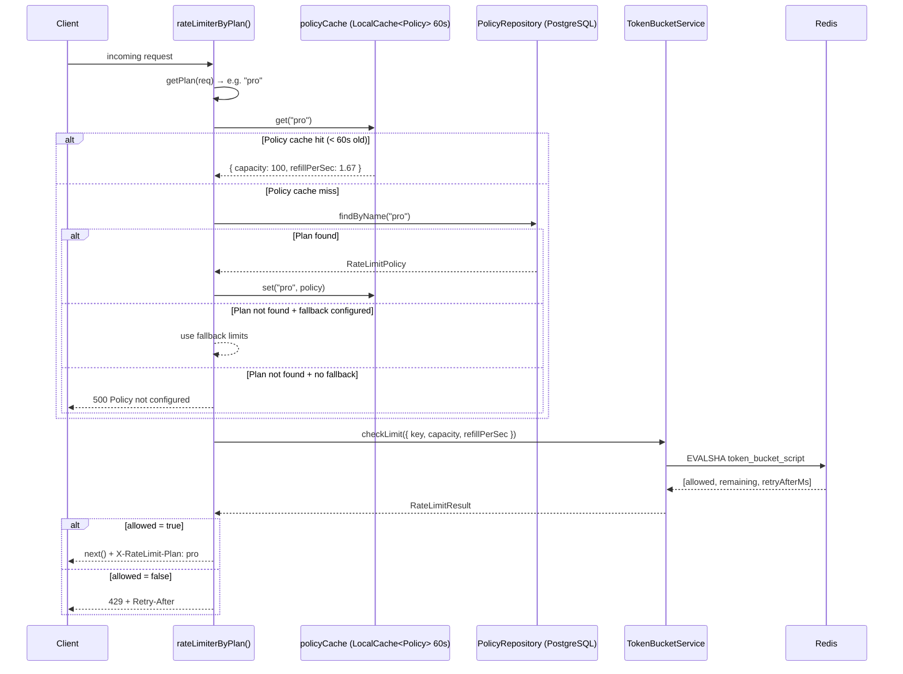
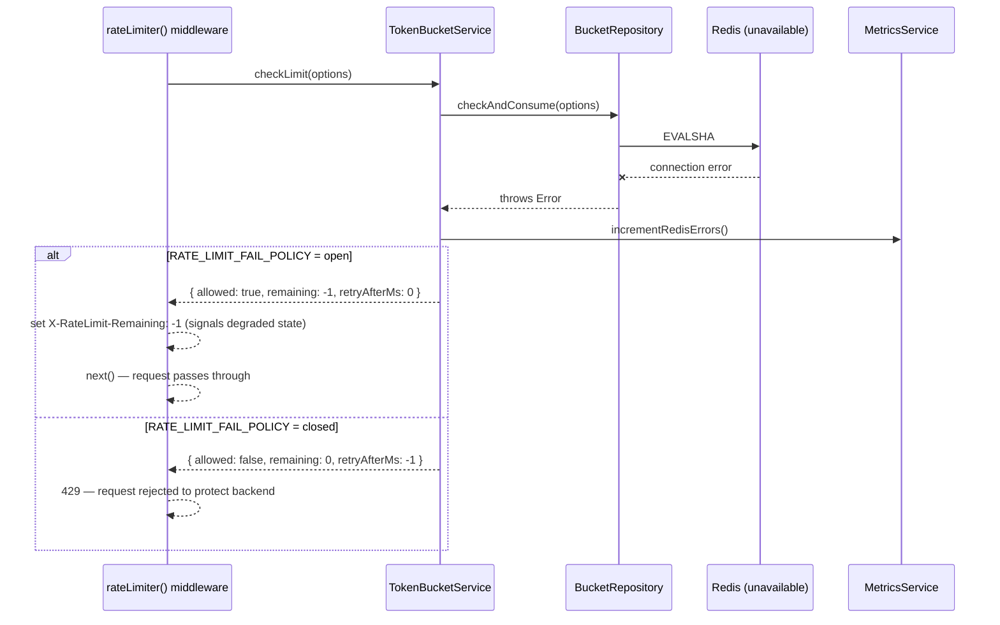
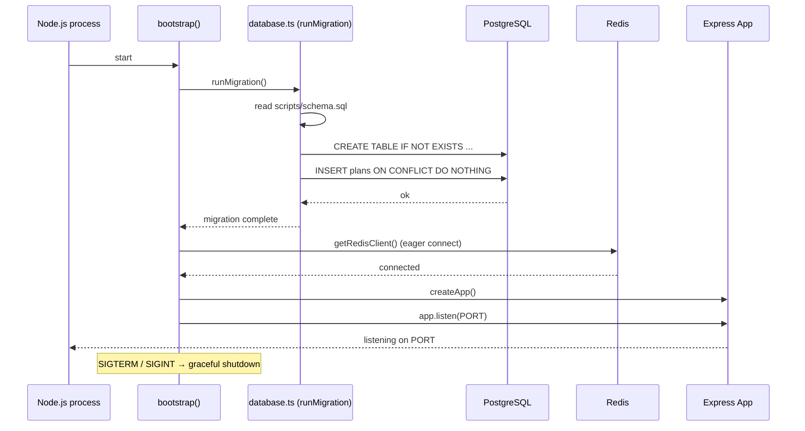

# Request Flow Diagrams

---

## A) Standalone Microservice — `POST /v1/ratelimit/check`

---

## B) Plan-aware Middleware — `rateLimiterByPlan()`

---

## C) Redis fail policy — what happens when Redis is down

---

## D) Startup — `bootstrap()`

